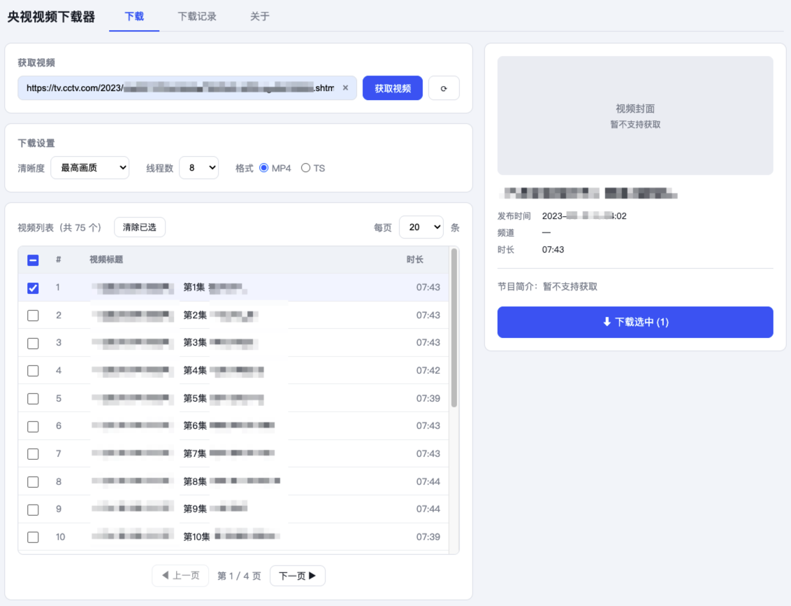
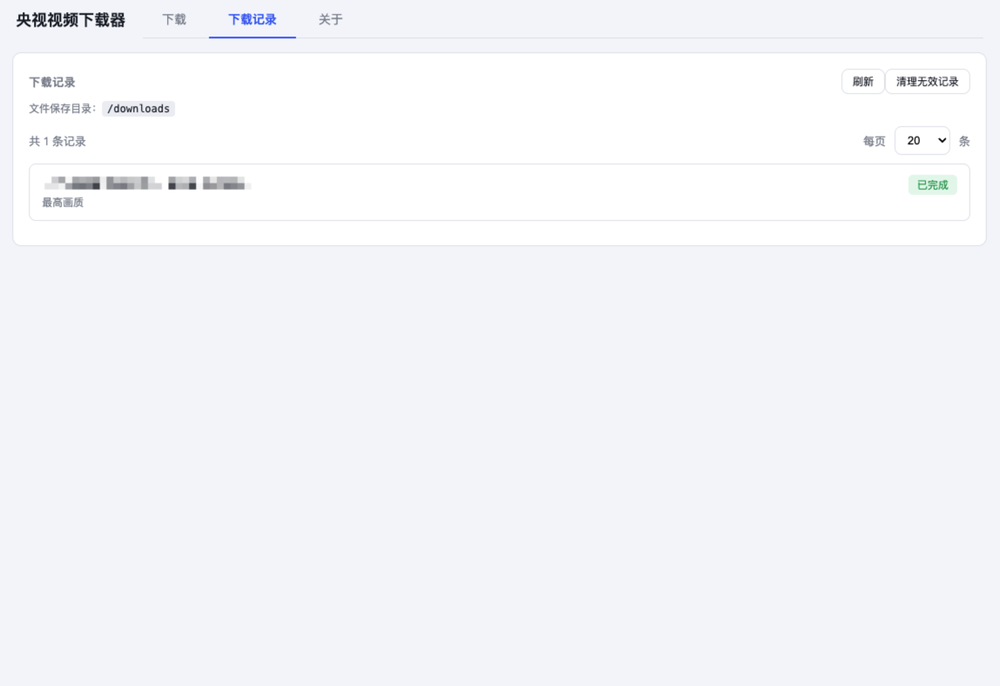

# 央视视频下载器 (Docker 版)

 

基于 [cctv-dl](https://github.com/letr007/CCTVVideoDownloader) 的央视视频下载 Web 应用，Docker 一键部署，开箱即用。

通过浏览器访问即可浏览央视网节目、勾选下载，下载的视频自动保存到挂载目录。

> 核心解析、下载、解密能力来自上游 [letr007/CCTVVideoDownloader](https://github.com/letr007/CCTVVideoDownloader) 的 `cctv-dl` 命令行工具。本项目提供 Web 界面与 Docker 封装。

---

## 功能

- 📺 输入央视节目链接，获取节目视频列表
- ☑️ 勾选多个视频批量下载（支持全选、分页）
- ⚙️ 可选清晰度（最高画质 / 蓝光 / 超清 / 高清 / 标清 / 流畅）、线程数、输出格式（MP4/TS）
- 📊 下载记录与实时进度展示
- 🗑️ 无效记录清理（文件被删除的记录自动标记为已失效）
- 🐳 Docker 一键部署，视频保存到宿主机挂载目录

---

## 界面预览





---

## 平台支持

| 平台 | 支持 | 说明 |
|---|---|---|
| Linux x86_64 | ✅ | 包括 x86 NAS、x86 云服务器、Intel Mac 的 Docker |
| Linux arm64 | ✅ | 包括 arm NAS、树莓派、arm 云服务器、Apple Silicon Mac 的 Docker |
| Apple Silicon Mac (M1/M2) | ✅ | Docker 容器为 linux/arm64，同上 |
| Windows / macOS 原生 | ❌ | 本项目为 Docker 版,需 Linux 容器环境 |

> 支持 Linux x86_64 和 arm64 架构。源码构建时 Dockerfile 会自动适配目标架构，无需手动指定。

---

## 安全登录

公网部署（云服务器、开放外网的 NAS）**务必启用登录**，否则任何人都能访问你的下载器。

### 首次登录密码

首次启动时，系统会自动生成一个随机密码，打印在容器日志中。查看：

```bash
docker logs cctv-dl-docker | grep 密码
```

默认账号 `admin`，用日志里的密码登录。

### 修改密码

在服务器执行（生成新随机密码）：

```bash
docker exec -it cctv-dl-docker python3 /app/backend/cli.py password
```

或指定新密码：

```bash
docker exec -it cctv-dl-docker python3 /app/backend/cli.py password --set 你的新密码
```

修改密码后，所有已登录会话失效，需用新密码重新登录。

### 安全说明

- 账号固定 `admin`，密码用 bcrypt 哈希存储，不存明文
- 登录后发 JWT token，有效期 1 天
- 登录接口限流：同 IP 失败 5 次将拒绝 15 分钟，防暴力破解
- ⚠️ 登录密码为明文传输，公网部署建议在前面套 HTTPS（如 Nginx 反代 + Let's Encrypt，或 Caddy）

---

## 快速开始

提供两种部署方式，任选其一。

### 方式一：源码构建（推荐，网络通畅时）

```bash
git clone https://github.com/xoba1937/cctv-dl-docker.git
cd cctv-dl-docker
docker compose up -d
```

首次启动会自动构建镜像（约 3-5 分钟），之后启动秒级。

### 方式二：离线镜像包（适合 NAS / 网络差 / 内网环境）

无需构建，直接导入预构建好的镜像。

**1. 下载离线镜像包**

从 [GitHub Release](https://github.com/xoba1937/cctv-dl-docker/releases/latest) 下载对应架构的离线镜像包：

- x86_64：`cctv-dl-docker.v*.linux.x86_64.tar`（约 147MB）
- arm64：`cctv-dl-docker.v*.linux.arm64.tar`（约 145MB）

> 请根据你的设备架构选择对应包（M1/M2 Mac、arm NAS 选 arm64；x86 设备选 x86_64）。

**2. 导入镜像**

```bash
docker load -i cctv-dl-docker.v*.linux.x86_64.tar    # 替换为实际下载的文件名
```

NAS 用户也可在 Docker 管理界面「镜像 → 导入」中上传该 `.tar` 文件。

**3. 获取配置文件并启动**

只需项目的 `docker-compose.yml` 等配置文件（无需完整源码）：

```bash
git clone https://github.com/xoba1937/cctv-dl-docker.git
cd cctv-dl-docker
docker compose up -d
```

由于镜像已导入，启动时不会再构建，直接运行。

### 访问

浏览器打开 `http://<主机IP>:3322`

下载的视频保存在 `./downloads` 目录（可在 `.env` 中配置）。

---

## 配置

复制 `.env.example` 为 `.env`，按需修改：

```env
# Web 服务端口（默认 3322）
PORT=3322

# 视频下载保存目录（宿主机路径，挂载到容器内 /downloads）
DOWNLOAD_DIR=./downloads
```

---

## 使用说明

1. 在「下载」页粘贴央视节目链接（如栏目页或专辑页），点击「获取视频」
2. 在视频列表中勾选要下载的视频（可多选、全选、翻页）
3. 在「下载设置」中选择清晰度、线程数、格式
4. 点击「下载选中」提交下载任务
5. 在「下载记录」页查看进度，完成后到保存目录取文件

### 支持的链接类型

- 栏目页（如新闻联播）：`https://tv.cctv.com/lm/xwlb/index.shtml`
- 专辑/单集页：`https://tv.cctv.com/2023/08/30/VIDA....shtml`

---

## 版本更新

当本项目发布新版本时，按以下方式更新已部署的服务。

### 方式一：源码部署的更新

```bash
cd cctv-dl-docker
git pull                        # 拉取最新代码
docker compose down             # 停止旧容器
docker compose up -d --build    # 重新构建镜像并启动（--build 必须加）
```

> `--build` 会用新代码重新构建镜像，不加会继续用旧镜像。

### 方式二：离线包部署的更新

1. 从 [Release](https://github.com/xoba1937/cctv-dl-docker/releases/latest) 下载新版离线镜像包
2. 导入新镜像并重启：

```bash
cd cctv-dl-docker
docker compose down
docker load -i cctv-dl-docker.v*.linux.x86_64.tar    # 替换为实际下载的文件名    # 导入新版镜像
docker compose up -d                    # 启动（自动使用新镜像）
```

### 数据保留

- 已下载的视频文件：保留（在挂载的 `downloads` 目录，不受更新影响）
- 下载任务记录：保留（存在 `downloads/.cctvdl_tasks.json`）

---

## 项目结构

```
cctv-dl-docker/
├── Dockerfile                 # 多阶段构建（解压cctv-dl + Python环境）
├── docker-compose.yml         # 一键启动配置
├── .env.example               # 端口/目录配置示例
├── vendor/
│   └── cctv-dl.v*.linux.x86_64.tar.gz   # 内置的cctv-dl（避免构建时下载）
├── backend/
│   ├── main.py                # FastAPI 服务
│   ├── cctv.py                # cctv-dl 调用封装
│   ├── tasks.py               # 下载任务管理（串行队列 + 持久化）
│   └── requirements.txt
└── frontend/
    └── index.html             # 单页 Web UI
```

---

## 跟随上游更新

核心工具 `cctv-dl` 内置于 `vendor/` 目录。当上游发布新版本时：

1. 下载新版 `cctv-dl.*.linux.x86_64.tar.gz`
2. 替换 `vendor/` 下的旧包
3. 重新构建：`docker compose build && docker compose up -d`

---

## 常见问题

**Q: 构建时拉取基础镜像很慢？**
A: 修改 Dockerfile 中已配置国内镜像源（阿里云 Debian 源 + PyPI 源）。如仍慢，可自行配置 Docker 镜像加速器。

**Q: 下载失败提示进程错误？**
A: 通常是网络问题或链接不支持。请确认链接为央视网（tv.cctv.com）的有效节目页。

**Q: 视频文件在哪？**
A: 默认在 `./downloads` 目录（或你配置的 `DOWNLOAD_DIR`），在宿主机直接访问。

---

## 免责声明

- 本工具仅供技术研究和学习交流使用
- 严禁用于任何侵犯版权的行为
- 禁止用于商业用途
- 央视网（CCTV）所有视频内容版权归中央广播电视总台所有
- 使用者需自行承担因使用本工具而产生的所有法律责任

## 致谢

核心能力来自 [letr007/CCTVVideoDownloader](https://github.com/letr007/CCTVVideoDownloader)，感谢原作者 [Letr](https://github.com/letr007) 的工作。

## License

[GPL-3.0](LICENSE)（跟随上游 cctv-dl 的协议）
